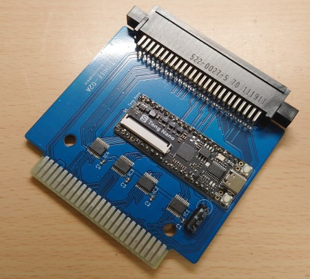
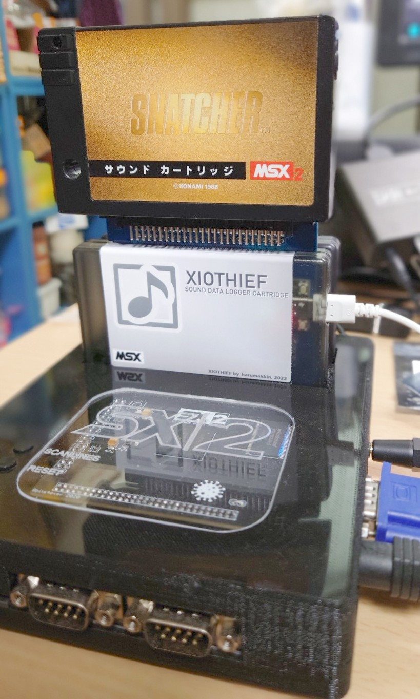

# XIOTHIEF
### これはなに？
XIOTHIEFはMSXの音源チップ（PSG、OPLL、SCCカートリッジ）へのアクセスデータをログするためのカートリッジです。MSXのスロットに挿して使用します。XIOTHIEFはその内部にログデータを蓄積する能力は無いので専用のアプリケーション(ThiefGriffin)を起動したWindowsPCとUSBケーブルでつないで使います。音源チップへのアクセスデータはWindowsPCへ送られファイルに保存されます。保存したファイルは[RaMsxMuse](https://www.blogger.com/blog/post/edit/9042999106271414651/2248008651663566437)を使って再生することができます。またTGF Editorというアプリケーションを使って記録したログデータの編集を行うことができます。

製作例(XIOTHIEF)


使用例(XIOTHIEF + SCC cartridge + SX-2)


### 用語の整理
|用語|意味|
|:-|:-|
|XIOTHIEF|MSXの音源チップ（PSG、OPLL、SCCカートリッジ）へのアクセスデータをログするためのカートリッジ|
|ThiefGriffin|Windowsコンソールアプリケーション、XIOTHIEFからアクセスデータを逐次受信して、最後にTGFファイル化するためのもの|
|TGF Editor|Windowsアプリケーション。TGFファイルを編集する。編集といっても指定部分を間引くという機能しかない||
|thief-tgfp|ThiefGriffinで出力したファイルをRaMsxMuse環境上で再生するためのLinuxコンソールアプリケーション|
|[RaMsxMuse](https://cllifgraph.blogspot.com/p/ramsxmuse.html)|YM2413(OPLL音源)とYMZ294-D(PSG音源相当)を搭載したRaspberryPiアドオンボード|
|[RaSCC](https://cllifgraph.blogspot.com/p/ramsxmuse.html)|SCC音源相当回路を搭載したRaspberryPi用の拡張基板。[WaveTableSound circuit for MSX]( https://github.com/hra1129/wave_table_sound)(Copyright (c) 2021 HRA!)をRaSCC用に一部修正した回路を使用している|

### XIOTHIEFのガーバーデータと部品表
ガーバーデータと部品表を git で公開しています。
- ガーバーデータ
- 部品表
- 回路図

### 基板製造発注
私はプリント基板製造サービス[FusionPCB](https://www.fusionpcb.jp/)を利用しています。ここに製造を発注する場合は“gerber_XIOTHIEF-02A.zip”を使用します。
※カードエッジ部の研磨はありません。依頼できるのかもしれませんが方法がわからない、、、
ほかの業者も同様だと思うのですがWebから簡単に発注できます。
最小5枚で4.9ドルです(2022/11現在)。送料は 20ドルぐらいでしょうか。
発注に慣れていない方のためにガーバーデータ登録時の基板情報を記しておきます。

材質：FR-4 TG 130
層数：二層
寸法：89.4*80.9 単位mm ←最初にガーバーデータをアップロードしておけば自動的に入力されます
製造枚数：5
異種面付けの種類：１
板厚：1.60
レジスト色（基板の色）：お好みで、、、色によって価格、納期が多少変わります。
基板の表面処理：HASL
最小ソルダレジストダムの幅：0.4mm
銅箔圧：1oz
最小穴径：0.3mm
最小パターン幅／パターン間隔：6/6mil
端面スルーホール：なし
インピーダンス制御：なし

### 組立
部品表を参考に部品をそろえ実装してください。基板をカートリッジシェルに納めて使用したい場合はカートリッジシェルの入手と加工が必要です。詳細は下記を参照ください。
- TangNanoのはんだ付けの際に、TangNano付属のピンヘッダをそのまま使用すると厚みが出てしまいカートリッジシェルに納まりません。ピンヘッダの金具をすべて受信から引き抜き、XIOTHIEF基板とTangNano基板を密着させた後にピンを挿してはんだ付けします。ぎりぎりシェルに納まる厚みになります。
- XIOTHIEF専用のカートリッジシェルがあればそんな物はありません。[RETRO GAME RESTORE](https://retrogamerestore.com/store/msx_cart_shell/)で販売されているカートリッジシェルを加工して使用してください。XIOTHIEF基板上部の50ピンカードエッジコネクタ部（別のカートリッジを挿すための部位）はカートリッジシェルから突出挿せるためにカートリッジシェルを削る必要があります。またとUSBケーブル接続のための穴も開ける必要があります。面倒なので裸のまま使用することをお勧めします。XIOTHIEF基板の穴位置はKONAMIスタイルです。

### TnagNanoのファームウェア更新
TangNanoは実装されているCH552Tチップのファームウェア更新が必要になります。[Tang NanoのFPGAとPC間でUART通信をする](https://qiita.com/ciniml/items/05ac7fd2515ceed3f88d)を参考に行っておきます。ちなみにこの記事ではFT_Progを使用してCH552Tを書き込みモードにできると紹介されていますが、私が試したときは書き込みモードになるっぽいんですが、そこからWCHISPToolを使ってファームウェアを書き込むことができませんでした。CH552Tの14番ピンと20番ピンをショートではできました。

### TnagNanoへのビットストリームファイルのダウンロード
XIOTHIEFに書き込むビットストリームファイルは、FpgaXIOTHIEF-01B.fsです。TangNanoの開発環境 GowinソフトウェアのProgrammerを使用して書き込んでください。

### ログの取り方（XIOTHIEFの使い方）
1. WindowsPCでターミナルを開く（PowerShell、コマンドプロンプトどちらでも）
2. .\ThiefGriffin.exe -l を実行して現在のCOMポートをリストを表示する。TangNanoの白色LEDと赤色LEDが店頭するはず。
3. XIOTHIEFとUSBケーブル(TypeC-TypeA)をWindowsPCに接続する。
4. 再度、.\ThiefGriffin.exe -l を実行して、増えたCOMポートを確認しておく
5. .\ThiefGriffin.exe -c COM2 を実行する。（COM2の部分は4.で確認したCOM番号にしてください）
6. XIOTHIEFをMSXに接続しMSXの電源を入れる、下記のような表示と数字がカウントアップされていれば動作OKです。いったん何かキーを押し、XIOTHIEFを終了させる。
``` 　
ThiefGriffin. 2022 Harumakkin
 Opend COM port:COM16
54 (  1/7), 45 (0):  TC----00002EB8
```
7. 次にファイル名付きで実行する。拡張子はなんでも良いが .mdat を推奨する。
```
.\ThiefGriffin.exe -c COM16 -f filename.mdat
```
8. MSXの電源を入れ、ゲームなり遊ぶと音源のアクセスデータがログされていく。
9. なんでも良いのでキーを押せばThiefGriffinは停止するが、Ctrl+Cを使用してはいけない。ThiefGriffinは終了時にファイル保存を行うため、Ctrl+Cで停止させてしまうと、ファイルが保存されないためである。
10. 出来上がったファイルは、RaMsxMuse環境下のthief-tgfpで再生できる、はず。
11. 注意）SCCカートリッジを使用する場合は必ずXIOTHIEFのエッジコネクタに挿して使用すること。XIOTHIEFとは別のスロットに接続すると、SCCへのアクセスを読み取りログすることができない。

### 仕組みのお話

#### XIOTHIEF ログの取り方
XIOTHIEFとは特定の決められたI/Oポートへの出力や、XIOTHIEFに接続したカートリッジの特定アドレスへのメモリ書き込み値を読み取り、読み取った値はUSB（UART）ケーブルを使用してロガーアプリケーションへ送信するハードウェアです。
XIOTHIEFが検出できるアクセスは下記の通り
- VSINC割込み（方法は後述）
- PSG音源チップ へのポート出力(I/Oポート A0h,A1hへのライト）
- OPLL音源チップ へのポート出力(I/Oポート 7Ch,7Dhへのライト）
- SCC音源チップへのメモリ書き込み(メモリアドレス 9000h、9800h～98FFh B000h、B800h～B8FFh、へのいずれかへのライト）

XIOTHIEFが取得した情報は、どのデバイスへ書き込みされたのかその識別コード、I/Oアドレス(メモリアドレス)とその書き込みデータで構成しています。これを１レコードと呼びサイズは３バイトです。XIOTHIEFはレコード単位でWindowsPCへ送信します。
ただこれだけではログデータを再生しようとしたときに、いつアクセスされたデータなのかわからないためアクセスを再現させることができません。曲としてのテンポを再現できないということです。なので本来はレコードにはいつを示す時間情報を付加する必要がありますがレコードサイズが大きくなってしまうためそれはやりたくありません（
サイズが大きくなってしまうことによる問題は確認していないので、サイズを小さくするというのは私の気持ちの域でしかないのが正直なところ。サイズが大きくなるのは面白くない、ただそれだけです）。
MSXの音源ドライバはVSYNC割込み処理内、あるは割込み処理内ではないにしてもVSYNCに同期して、音源にアクセスしているのが一般的だと思います。なので音源チップへのアクセスつどその時刻を記録するのではなく、VSYNC割込みの発生時刻だけを記録して、ログデータに挟み込んでいき、ログデータを再生する時はその情報をもとにアクセスタイミングを作っていけばよいと考えました。

#### VSYNCの検出方法
カートリッジスロットに挿して使用するXIOTHIEFは、ハードウェア的にVSYNC割込みを検出することができません。なので、システムROM内の"VSYNC割込み処理"の中で必ず行われている"VDPのステータスレジスタを読む"（I/Oポートアクセス）を監視することでこれを検出するようにしています。より正確にいうと、この"VDPのステータスレジスタを読む"は、VDPのステータスレジスタ #S0 の読み出しのことで、この#S0の読み出し値のMSBが1だった時、VSYNC割込み発生と判断しています。MSXでは#S0の読み出し行為はシステムROM内の"VSYNC割込み処理"の一か所だけと決められているので、MSBまではチェックしなくても良いかもしれません。VDPの#S0の読み出しはI/Oポートのリードを検出すればよいのですが、少しの工夫が必要です。I/Oアドレス 99hのリードを監視すればよいわけですが、VDPは #S0 以外にも多くのレジスタを持っていいて、それらのレジスタの値もI/Oポート99hからリードできるようになっています。なので、VDPのために用意されている 他のI/Oポートへのアクセスを監視して、事前に#S0をI/Oポート99hからリードしようとしているかどうかを判断する仕組みが必要でした。VDPの#R15と#R17レジスタの動作をマネするようにしました。
VSYNC割込みを検出するとそれを示すレコードを１つログするようにしています。レコードには割込みのたびにインクリメントされるカウンタが含まれています（レコード間の相対的時間を示すような情報ではなく、XIOTHIEFが起動してからのVSYNC割込み回数を示す）。

##### ステータスレジスタボインタ(R15)に0がセットされていることを監視する
- VDPレジスタのR15、R17への書き込み動作を模倣しR15に0がセットされたかどうかを判断する。
- ポート99hへの連続した書き込みを監視し、一回目の書き込みはレジスタへのデータ書き込み、二回目の書き込みはレジスタ番号の書き込みと判断する。
- ポート99hへ{xxh, 8Fh}が書き込まれたら、xxhをR15の値として保持する。
- ポート99hへ{xxh, 97h}が書き込まれたら、xxhをR17の値として保持し、非インクリメントモードであることも記録する。
- ポート99hへ{xxh, 17h}が書き込まれたら、xxhをR17の値として保持し、インクリメントモードであることも記録する。
- ポート9Bhへ{xxh}が書き込まれたとき、
	R17が15なら、
		R15 ← xxh
	それとインクリメントモードなら、
		R17 ← R17 + 1
- R15=0のときに、IOポート99hの読み出しが行われたら、データバスにはステータスレジスタ#0 の値がVDPにより出力されていると判断してそれを盗み見て、その値のMSBが1なら、VSYNCの割り込み処理中であると判断する。

**Table.1 V9938のポート(MSX-Datapack volume1 p.448)**
|#|R/W|アドレス|意味|
|:-|:-|:-|--|
|ボート#0|(READ)|m|VRAMからのデータを読み出し|
|ボート#0|(WRITE)|n|VRAMへのデータ書き込み|
|ポート#1|(READ)|m+l|ステータスレジスタの読み出し|
|ボート#1|(WRITE)|n+l|コントロールレジスタヘの書き込み|
|ポート#2|(READ)|n+2|パレットレジスタヘの書き込み|
|ポート#3|(WRITE)|n+3|間接指定されたレジスタヘのデータ書き込み|
　

参考) SCCの仕様 http://d4.princess.ne.jp/msx/scc/scc2.html
参考) VSYNC割込み処理 MSX-Datapack volume1 p.71

#### レコード

レコードはTable.1に示すように11種類あります（うち3種類は構想段階であり未実装）。
１レコードは[code][data1][data2]の３バイトで構成されています。
例えば、
- 03h 01h 24h という値を持つレコードは OPLL のレジスタ01hへ24hを書き込むことを示します。
- 06h 20h 10h という値を持つレコードは メモリ(SCC) 9820hへ10hを書き込むことを示します。
- Table.2のタイムコードはVSYNC割込みの情報のことです。[code]部にまでカウンタ値が含まれていることに注意してください。

**Table.2. レコード種別**
|code|意味|詳細|
|:-|:-|:-|
|00h|NOP|No Operation(将来対応)|
|01h|SYSINFO|システム情報(将来対応)|
|02h|WAIT|待ち時間(将来対応)|
|03h|OPLL|YM2413のレジスタアクセス情報<br>[code] = 0000_0011B<br>[data1]= Register address<br>[data2]= Register data|
|04h|PSG|PSG(YM2149,YMZ294)のレジスタアクセス情報<br>[code] = 0000_0100B<br>[data1]= Register address<br>[data2]= Register data|
|05h|SCC_90|SCC 9000h アクセス情報<br>[code] = 0000_1000B<br>[data1]= 00h<br>[data2]= memory data|
|06h|SCC_98|SCC 98xxh アクセス情報<br>[code] = 0000_1001B<br>[data1]= 98xxh address<br>[data2]= memory data|
|07h|SCC_B0|SCC B000h アクセス情報<br>[code] = 0000_1010B<br>[data1]= 00h<br>[data2]= memory data|
|08h|SCC_B9|SCC B9xxh アクセス情報<br>[code] = 0000_1011B<br>[data1]= B8xxh address<br>[data2]= memory data|
|09h|SCC_BF|SCC BFFEh アクセス情報<br>[code] = 0000_1100B<br>[data1]= FEh<br>[data2]= memory data|
|80h|TIMECODE|タイムコード<br>正確には80hではなくbit7が1のときにタイムコードである<br>タイムコード値そのものは23ビットの整数である。codeのbit6～bit0、data1、data2をビット連結した計23ビットであらわされる。最大値は8,388,607であり16.6ms周期(VSYNC)でカウントアップしていくので約38.8時間まで。<br>[code] = 1xxx_xxxxB<br>[data1]= yyyy_yyyyb<br>[data2]= zzzz_zzzzb<br>0xxx_xxxx_yyyy_yyyy_zzzz_zzzz の23ビット値|

#### ThiefGriffin 出力ファイル

ThiefGriffinが書き出すファイルの中身は、Table.2 に示す書式のレコードの羅列でしかありません。ヘッダ情報など気の利いた物もなく、シンプルです。
ファイルの拡張子は .mdat をおすすめします。

以上


